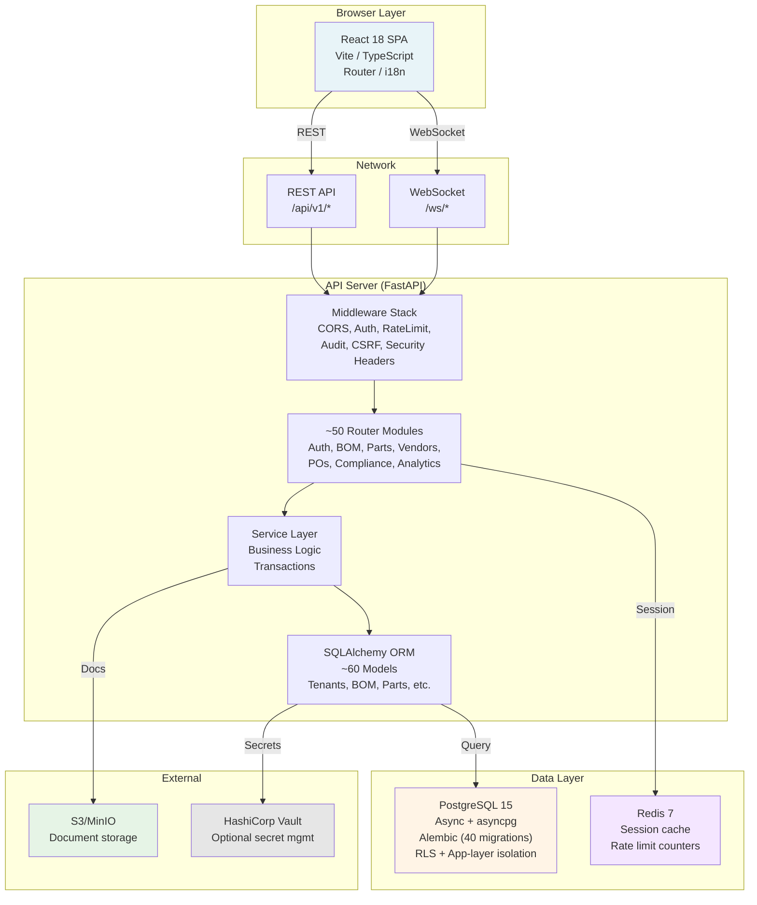

# Architecture: Blackbox BOM

**Date:** 2026-07-19 · **Release:** v2.0.0 (branch `master`)

A comprehensive technical overview of the Blackbox BOM platform architecture, patterns, and deployment topology. This document describes the shipped system as of the current release and is the single source of truth for system design decisions, constraints, and future directions.

---

## Table of Contents

1. [Overview](#overview)
2. [System Architecture](#system-architecture)
3. [Design Patterns](#design-patterns)
4. [Technology Stack](#technology-stack)
5. [Database Architecture](#database-architecture)
6. [API Architecture](#api-architecture)
7. [Security Architecture](#security-architecture)
8. [Deployment Architecture](#deployment-architecture)
9. [Scalability & Reliability](#scalability--reliability)
10. [Known Issues & Open Items](#known-issues--open-items)
11. [Future Roadmap](#future-roadmap)
12. [References](#references)

---

## Overview

**Blackbox BOM** is a local-first (on-premises, in-house storage primary) enterprise Bill of Materials and Product Lifecycle Management platform. It competes with OpenBOM, emphasizing data sovereignty, no cloud lock-in, and a deeply integrated multi-tenant backend with a modern React frontend.

**Key principles:**
- **Local-first:** Primary storage and processing on-premises; cloud connectivity optional, never required for core functionality.
- **Multi-tenant:** Secure data isolation across organizations with app-layer filtering and optional Postgres Row-Level Security (RLS).
- **Enterprise-grade:** ~500 REST API routes, RBAC with tenant-scoped permissions, audit logging, e-signature-ready infrastructure, and regulatory compliance hooks.
- **Modern stack:** Async Python (FastAPI + SQLAlchemy 2.0) + React 18 + PostgreSQL 15 with Alembic schema versioning.

---

## System Architecture

### Layered Architecture

The system is organized into a classic three-tier + database + services pattern:

```
┌─────────────────────────────────────────────────────────────┐
│                    Frontend (React + Vite)                  │
│          Browser-side state + navigation + UI logic         │
└────────────────────┬────────────────────────────────────────┘
                     │ REST / WebSocket
                     │
┌────────────────────▼────────────────────────────────────────┐
│                 API Gateway / Load Balancer                 │
│                    (nginx in Docker Compose)                │
└────────────────────┬────────────────────────────────────────┘
                     │
┌────────────────────▼────────────────────────────────────────┐
│              FastAPI Application Server                     │
│  ┌─────────────────────────────────────────────────────────┐│
│  │ Routers (app/api/endpoints/*)                          ││
│  │  - Auth, BOM, Parts, Vendors, POs, Compliance, etc.   ││
│  ├─────────────────────────────────────────────────────────┤│
│  │ Middleware (Security, CORS, Rate Limit, Audit)         ││
│  ├─────────────────────────────────────────────────────────┤│
│  │ Services (app/services/*)                              ││
│  │  - Business logic, validations, integrations           ││
│  └─────────────────────────────────────────────────────────┘│
└────────────────────┬────────────────────────────────────────┘
                     │ asyncpg / Redis
                     │
        ┌────────────┴──────────────┬──────────────┐
        │                           │              │
┌───────▼─────────┐    ┌───────────▼────┐  ┌─────▼────┐
│   PostgreSQL    │    │  Redis Cache   │  │ S3/MinIO │
│   (Primary DB)  │    │  (Sessions)    │  │(Documents)│
└─────────────────┘    └────────────────┘  └──────────┘
```

### Component Diagram



---

## Design Patterns

### 1. Multi-Tenant Isolation

**Pattern:** Hybrid isolation — app-layer filtering + optional Postgres RLS.

**Implementation:**
- Every tenant-aware model inherits `TenantAwareMixin` (adds `tenantId` column).
- SQLAlchemy ORM event listeners (in `app/core/tenant_events.py`) automatically:
  - **INSERT:** Populate `tenantId` from current tenant context.
  - **SELECT:** Filter all queries by `WHERE tenantId = ?`.
  - **UPDATE/DELETE:** Warn about unguarded operations.
- Optional Postgres RLS (`ENABLE_RLS` flag) provides defense-in-depth:
  - `SET LOCAL app.current_tenant` per transaction.
  - `FORCE ROW LEVEL SECURITY` on app-owned tables.
  - Postgres-only test track; not currently covered by SQLite tests.

**Business keys:** Composite unique constraints use `(tenantId, business_key)` — e.g., `(tenantId, bom_number)`, `(tenantId, part_number)` — to prevent cross-tenant key collisions.

**File references:**
- `app/core/tenant_events.py` — ORM event registration
- `app/models/mixins.py` — `TenantAwareMixin` definition
- `alembic/versions/040_postgres_rls_tenant_isolation.py` — RLS schema

### 2. Service Layer & Repository Pattern

**Pattern:** Service classes encapsulate business logic; models act as lightweight repositories.

**Structure:**
- **Models** (`app/models/*.py`): SQLAlchemy ORM with query helpers and relationships.
- **Services** (`app/services/*.py`): High-level operations (e.g., `BomService.create_bom_item()`, `PartService.update_cost()`).
- **Routers** (`app/api/endpoints/*.py`): HTTP handlers that delegate to services.

**Example flow:**
```
POST /api/v1/boms/{bom_id}/items → Routers.create_bom_item()
  → BomService.create_bom_item()
    → BomItem model + BomClosure updates
    → Tenant + RLS filters applied by ORM event listeners
    → Transaction committed
```

**Benefits:**
- Centralized authorization checks (services layer).
- Testable business logic decoupled from HTTP.
- Transactional consistency.

### 3. Closure Table for BOM Explosion

**Pattern:** Adjacency closure table for O(1) multi-level BOM lookups.

**Design:**
- **Table:** `bom_closures` (tenantId, bom_id, ancestor_item_id, descendant_item_id, depth).
- **Semantics:** For every reachable (ancestor, descendant) pair in a BOM's instance-line tree, one row exists, including self-references (depth=0).
- **Operations:**
  - Explosion (all descendants): `WHERE ancestor_item_id = ? ORDER BY depth`.
  - Where-used (all ancestors): `WHERE descendant_item_id = ?`.
  - Both queries run in a single round-trip.

**Maintenance:** Incremental updates via `BomService.create_bom_item()`, `update_bom_item()`, `delete_bom_item()` — **never write to the closure table directly.**

**Security:** Always scope queries by both `tenantId` AND `bom_id` to prevent cross-tenant/BOM leakage.

**File references:**
- `app/models/bom_closure.py` — Model + constraints
- `app/services/bom_service.py` — Closure table maintenance
- `alembic/versions/039_bom_closure_table.py` — Schema

### 4. Dependency Injection via FastAPI

**Pattern:** FastAPI `Depends()` for injection of database sessions, authentication state, and tenant context.

**Example:**
```python
@router.get("/boms")
async def list_boms(
    session: AsyncSession = Depends(get_session),
    current_user: User = Depends(get_current_user),
    tenant_id: int = Depends(get_tenant_id),
):
    # session, current_user, tenant_id auto-resolved
    pass
```

**Benefits:**
- Automatic cleanup (session lifecycle managed by FastAPI).
- Testable (inject mocks).
- Declarative security.

**File references:**
- `app/core/security.py` — `get_current_user()`, JWT validation.
- `app/db/session.py` — `get_session()` dependency.
- `app/core/tenant_context.py` — `get_tenant_id()` dependency.

### 5. Event Listeners for Tenancy & Audit

**Pattern:** SQLAlchemy `@event.listens_for()` decorators hook ORM operations.

**Use cases:**
- Auto-populate `tenantId` on INSERT.
- Filter all SELECTs by `tenantId`.
- Audit logging via `before_flush` hooks.
- Query performance metrics.

**File references:**
- `app/core/tenant_events.py` — Tenant isolation listeners.
- `app/models/audit_log.py`, `app/core/audit_middleware.py` — Audit trail.

### 6. Frontend Shim/Registry Architecture

**Pattern:** Components in `src/root/` register themselves on `window.*`; actual implementations in `src/components/**` are wired via `LazyScreens.jsx`.

**Rationale:** Decouples component discovery from import order; enables dynamic loading and composition.

**Structure:**
```
src/
  root/
    dashboardShim.jsx   → window.DashboardScreen
    bomsShim.jsx        → window.BOMScreen
    ...
  components/
    Dashboard.jsx       ← imported by DashboardShim
    BOMEditor.jsx       ← imported by BOMShim
    LazyScreens.jsx     ← central registry resolver
  context/
    AppCtx.jsx          ← global state (auth, bom_data, permissions)
  utils/
    storage.js          ← localStorage + sessionStorage helpers
    api.js              ← REST client with auto-retry + refresh token
```

**Benefits:**
- Scales to large component trees.
- Lazy-load screens on demand.
- Single AppContext for shared state.

**File references:**
- `src/components/LazyScreens.jsx` — Registry.
- `src/context/AppCtx.jsx` — Global state + permissions.
- `src/utils/storage.js` — Persistence layer.

---

## Technology Stack

### Backend

| Component | Version | Purpose |
|-----------|---------|---------|
| **FastAPI** | ≥0.111 | REST API framework; dependency injection; OpenAPI docs. |
| **Uvicorn** | ≥0.29 | ASGI server; async request handling. |
| **SQLAlchemy** | ≥2.0 + asyncio | ORM; async query execution via asyncpg. |
| **asyncpg** | ≥0.29 | PostgreSQL async driver; prepared statements. |
| **Alembic** | ≥1.13 | Schema versioning; 40 migrations to current state. |
| **Pydantic** | ≥2.7 | Request/response validation; settings management. |
| **PyJWT** | ≥2.8 | RS256 JWT token encoding/verification. |
| **bcrypt** | ≥4.1 | Password hashing. |
| **cryptography** | ≥42.0 | RSA key generation; encryption. |
| **pyotp** | ≥2.9 | TOTP 2FA. |
| **slowapi** | ≥0.1.9 | Rate limiting; leaky-bucket algorithm. |
| **Redis** | ≥5.0 | Session cache; rate-limit counters. |
| **Sentry SDK** | ≥2.0 | Error tracking + performance monitoring. |
| **python-barcode** | ≥0.15 | Barcode generation (EAN, UPC, Code128). |
| **qrcode** | ≥7.4 | QR code generation. |
| **openpyxl** | ≥3.1 | Excel export (.xlsx). |
| **reportlab** | ≥4.1 | PDF generation + styling. |
| **Pillow** | ≥10.3 | Image processing for barcodes/QR. |
| **python-magic** | ≥0.4.27 | MIME type detection. |
| **aiobotocore** | ≥2.12 | Async S3/MinIO client. |
| **BeautifulSoup4** | ≥4.12 | HTML parsing (document extraction). |

**Python:** 3.12 (slim Docker image).

### Frontend

| Component | Version | Purpose |
|-----------|---------|---------|
| **React** | ^18.3 | UI framework; component model. |
| **react-router-dom** | ^7.18 | Client-side routing. |
| **react-i18next** | ^17.0 | Internationalization (i18n). |
| **i18next** | ^26.3 | i18n runtime + language detection. |
| **Three.js** | ^0.184 | 3D visualization (CAD preview, future). |
| **Vite** | ^6.3 | Build tool; dev server; module federation. |
| **TypeScript** | ^6.0 | Type safety. |
| **vitest** | ^4.1 | Unit test runner. |
| **Playwright** | ^1.60 | E2E testing. |
| **@testing-library** | Latest | React component testing. |
| **ESLint** | ^9.39 | Linting. |

**Design:** Two-tone olive (#B5BC38) + orange (#E85D1F) accent, Geist typeface, CSS design tokens in `src/styles.css`.

### Infrastructure

| Component | Version | Purpose |
|-----------|---------|---------|
| **PostgreSQL** | 15-alpine | Primary database; ACID compliance; RLS support. |
| **Redis** | 7-alpine | Cache + session storage. |
| **Docker** | 20.10+ | Containerization. |
| **Docker Compose** | 3.9 | Multi-container orchestration (dev, test, prod configs). |

---

## Database Architecture

### Schema Overview

**Current migration head:** `040_postgres_rls_tenant_isolation` (40 total migrations)

**Core entities:**

| Table | Purpose | Key Features |
|-------|---------|--------------|
| `tenants` | Organization containers. | Multi-tenant root. |
| `users` | User accounts. | RS256 JWT, RBAC roles. |
| `roles`, `permissions` | RBAC definitions. | Tenant-scoped. |
| `boms` | BOM headers. | `(tenantId, bom_number)` unique. |
| `bom_items_master` | BOM line items (instance lines). | Parent-child hierarchy; quantity/cost. |
| `bom_closures` | Adjacency closure table. | Fast explosion/where-used queries. |
| `bom_variants` | BOM variants. | Configuration management. |
| `bom_templates` | BOM templates (library). | Reusable patterns. |
| `bom_snapshots` | BOM version history. | Immutable snapshots. |
| `parts` | Part master data. | Global library; cross-BOM. |
| `part_vendors` | Vendor sourcing. | Lead time, cost, availability. |
| `vendors` | Supplier master. | Contact, scorecard. |
| `purchase_orders`, `po_line_items` | Purchase orders. | `POHeader`/`POLineItem` canonical (old `PurchaseOrder` deprecated). |
| `projects` | Project grouping. | Organize BOMs. |
| `compliance`, `substance` | RoHS/REACH compliance. | Substance declarations (regulatory foundation). |
| `eco` | Engineering Change Orders. | Change tracking, approval workflows. |
| `audit_logs`, `audit_log_changes` | Audit trail. | Who, what, when, why for all changes. |
| `approvals` | Approval workflows. | Multi-level sign-off (e-signature ready). |
| `sessions` | User sessions. | JWT token refresh; logout. |
| `integrations`, `erp_connectors` | External system sync. | Outbox pattern for reliability. |

**Additional tables:** 50+ more covering quality (CAPA, FAI, supplier scorecards), procurement (should-cost, RFQ), operations (work orders, resource scheduling), documents, comments, notifications, analytics, etc.

### Multi-Tenant Isolation

**Primary mechanism:** App-layer filtering via ORM event listeners.

**Scope:**
- Every tenant-aware entity has a `tenantId` column (NOT NULL, indexed).
- `app/core/tenant_context.py` maintains current tenant ID in async context variable.
- `app/core/tenant_events.py` registers listeners that:
  - Auto-populate `tenantId` on INSERT.
  - Filter all SELECTs automatically.
  - Guard UPDATEs/DELETEs.

**Optional RLS (Postgres):**
- Enable with `ENABLE_RLS=true` environment variable.
- Schema created in `040_postgres_rls_tenant_isolation` migration.
- Postgres enforces row access at the database level.
- Currently not covered by tests (SQLite-only test suite).

**Business Keys:**
All unique business keys are composite:
- `(tenantId, bom_number)` for BOMs.
- `(tenantId, part_number)` for parts.
- `(tenantId, poNumber)` for purchase orders.
- etc.

**Security:**
- Bare ID queries without `tenantId` scope are a P0 leak class.
- Closure table queries MUST scope by both `tenantId` AND `bom_id`.
- All queries through ORM; raw SQL queries are logged as warnings.

### Numeric Precision

**Decision:** Use `Numeric` type for all money and quantity fields to avoid floating-point rounding errors.

**Implementation:**
- Quantities: `Numeric(10, 4)` — e.g., 12.5000 units.
- Unit costs: `Numeric(10, 4)` — e.g., $1234.5678.
- Extended costs (line totals): `Numeric(15, 4)` — e.g., $123,456.7890.
- Decimal places configurable per field but standardized to 4 for consistency.

**File references:**
- `app/models/bom_item.py` — quantity, unit_cost_snapshot, extended_cost.
- `app/models/part_vendor.py` — lead_time, unit_cost, min_quantity.
- `app/models/po_models.py` — PO line extended price.

### Connection Pooling & Performance

**Async engine** (asyncpg):
- Pool size: 10 (default, configurable via `DB_POOL_SIZE`).
- Max overflow: 20 (burst connections).
- Pool pre-ping: Enabled (connection health check).
- Pool recycle: 3600s (prevents stale connections).

**Retry logic:**
- On startup, retry DB connection up to 5 times with exponential backoff (1, 2, 4, 8, 16 seconds).
- Mirrors Docker Compose health checks for resilience.

**Query metrics:**
- Query duration tracked via `before_cursor_execute` / `after_cursor_execute` events.
- Metrics sent to Sentry for performance monitoring.

**File references:**
- `app/db/session.py` — Engine initialization + retry logic.
- `app/monitoring/metrics.py` — Query timing.

---

## API Architecture

### REST API Structure

**Base path:** `/api/v1`

**~50 router modules** covering:

| Domain | Example Endpoints |
|--------|-------------------|
| **Auth** | POST /users/login, POST /users/logout, POST /users/refresh, GET /auth/me |
| **BOM Management** | GET/POST /boms, PATCH /boms/{id}, DELETE /boms/{id}, POST /boms/{id}/items, PATCH /bom-items/{id} |
| **Parts** | GET/POST /parts, PATCH /parts/{id}, GET /parts/{id}/vendors |
| **Vendors/Sourcing** | GET/POST /vendors, GET /part-vendors, POST /rfq |
| **Purchase Orders** | GET/POST /purchase-orders, PATCH /po-line-items/{id} |
| **Compliance** | GET /compliance/{id}, POST /compliance/{id}/substance |
| **ECO / Changes** | POST /eco, GET /eco/{id}, POST /eco/{id}/approve |
| **Quality** | POST /capa, GET /quality/metrics |
| **Analytics** | GET /analytics/bom-cost, GET /analytics/part-usage |
| **Documents** | POST /documents/upload, GET /documents/{id} |
| **Audit** | GET /audit-logs |
| **Integrations** | GET /integrations/sync-status, POST /erp-connectors/trigger-sync |
| **Admin** | GET /users, PATCH /users/{id}/role, GET /settings |

### Authentication & Authorization

**Authentication mechanism:** RS256 JWT tokens.

**Workflow:**
1. `POST /users/login` → username + password + optional TOTP (2FA).
2. Backend generates RSA 4096-bit key pair (if not exists).
3. JWT payload includes `sub` (user ID), `tenant_id`, `role`, `jti` (unique token ID), `exp`, `iat`, `type` (access/refresh).
4. Access token (30 min default) signed with RSA private key.
5. Refresh token (30 days default) stored in `sessions` table.
6. Client includes `Authorization: Bearer <access_token>` on subsequent requests.
7. Backend verifies signature using RSA public key.
8. On 401, client auto-refreshes using refresh token (if valid).
9. All requests filtered by `tenantId` from token payload.

**Authorization:** RBAC (role-based access control).

**Roles:**
- `Admin` — Full system access.
- `Engineering` — BOM edit, part master, ECO approval.
- `Procurement` — PO creation, vendor management.
- `Quality` — CAPA, FAI, compliance reports.
- `Viewer` — Read-only (default fallback).

**Permissions:** Tenant-scoped; defined in `roles`, `permissions` tables; checked in service layer and route handlers.

**2FA:** Optional TOTP (pyotp) — enabled per user.

**File references:**
- `app/core/security.py` — JWT creation, RSA key generation, entropy validation.
- `app/api/endpoints/auth.py` — Login, logout, refresh.
- `app/models/user.py`, `app/models/role.py`, `app/models/permission.py` — RBAC models.

### Rate Limiting

**Implementation:** slowapi (leaky-bucket algorithm).

**Configuration:**
- Default: 100 requests per minute per IP.
- Per-endpoint overrides (e.g., login: 5/min, bulk import: 10/min).
- Counters stored in Redis; resets on server restart.
- Returns HTTP 429 when exceeded.

**File references:**
- `app/core/rate_limit.py` — `limiter` initialization.
- `app/api/endpoints/*.py` — `@limiter.limit()` decorators.

### WebSocket for Real-Time

**Endpoint:** `/ws/{tenant_id}`

**Use cases:**
- Live BOM editor updates (multi-user editing).
- Real-time approval notifications.
- Bulk import progress.
- Integration sync status.

**Authentication:** JWT token in query param or header on WebSocket upgrade.

**File references:**
- `app/main.py` — WebSocket handler + auth middleware.
- `app/core/ws_auth.py` — `authenticate_websocket()`.

---

## Security Architecture

### Secrets Management

**Configuration source:** Pydantic `BaseSettings` + environment variables.

**Required secrets:**
- `SECRET_KEY` — HMAC key (if not using RSA).
- `ENCRYPTION_KEY` — Symmetric encryption key (AES-256); used to encrypt RSA private key at rest.
- `POSTGRES_PASSWORD` — Database password.
- `REDIS_PASSWORD` — Redis password.
- `S3_ACCESS_KEY`, `S3_SECRET_KEY` — S3/MinIO credentials (if document storage enabled).

**Generation (one-time):**
```bash
# Generate SECRET_KEY / ENCRYPTION_KEY with 80+ bits entropy
python -c "import secrets; print(secrets.token_urlsafe(32))"
```

**Entropy validation:**
- `_estimate_entropy()` in `config.py` computes Shannon entropy (bits).
- Secrets must exceed `MIN_SECRET_ENTROPY_THRESHOLD` (80 bits).
- Rejects weak secrets (hardcoded blacklist: "test", "changeme", "admin", etc.).

**Optional HashiCorp Vault integration:**
- If `VAULT_ADDR` + `VAULT_TOKEN` set, loads secrets from Vault.
- Fallback to environment variables if Vault unavailable.
- HTTP timeout: 5 seconds.

**File references:**
- `app/core/config.py` — `Settings` class, entropy checks, Vault loader.
- `.env.example` — Template for required variables.

### RSA Key Management

**Asymmetric signing (RS256 JWT):**

1. **Key generation** (one-time, on first startup):
   - 4096-bit RSA key pair generated via `cryptography` library.
   - Private key encrypted with AES-256 using `ENCRYPTION_KEY`.
   - Stored on disk: `app/core/security.py` writes to `RSA_KEY_DIR` (default: `/rsa_keys` in Docker).

2. **Key storage:**
   - `private.pem` — Private key (encrypted at rest).
   - `public.pem` — Public key (unencrypted; safe to share).
   - Both must be in `RSA_KEY_DIR`; readable by app process only (Docker: `bom` user, 0600 permissions).

3. **JWT signing:**
   - Every login generates a new JWT signed with private key.
   - Signature includes `jti` (unique token ID) for revocation tracking.

4. **JWT verification:**
   - Public key used to verify signatures.
   - Can be distributed to other services (API gateway, auth proxy).

**File references:**
- `app/core/security.py` — `_ensure_rsa_keys()`, `_get_jwt_key()`, `_get_jwt_verify_key()`.

### Input Validation & Sanitization

**Request validation:** Pydantic schemas on all endpoints.

**Input sanitization:**
- `InputSanitizationMiddleware` (in `app/core/sanitize.py`) strips HTML/script tags from string inputs.
- Prevents XSS via request payload.

**SQL injection prevention:**
- All queries via SQLAlchemy ORM (parameterized).
- Raw SQL queries logged as warnings.

**CSRF protection:**
- `CSRFMiddleware` verifies CSRF token on state-changing requests (POST, PATCH, DELETE).
- Token generated on login; included in response headers.
- Frontend must echo token on subsequent mutations.

**File references:**
- `app/core/sanitize.py` — Input sanitization.
- `app/core/csrf.py` — CSRF token generation + validation.

### Security Headers & HTTPS

**Security headers middleware** (`app/core/security_headers.py`):
- `Strict-Transport-Security: max-age=31536000` — HSTS.
- `X-Content-Type-Options: nosniff`.
- `X-Frame-Options: DENY`.
- `Content-Security-Policy: default-src 'self'` (blocks inline scripts).
- `Referrer-Policy: no-referrer`.

**HTTPS:**
- Enforced in production via nginx (frontend service).
- Local dev uses HTTP (localhost only).

**CORS:**
- Allowed origins: Configured per deployment (default: `http://localhost:3000` for dev).
- Credentials: Allowed (includes cookie-based sessions).

**File references:**
- `app/core/security_headers.py` — Headers middleware.
- `app/main.py` — CORS configuration.

### Audit Logging & Compliance

**Every mutation is logged:**
- `before_flush` ORM event captures changes.
- `audit_logs` table stores: user, timestamp, action (INSERT/UPDATE/DELETE).
- `audit_log_changes` table stores: field name, old value, new value (for UPDATE only).

**Use cases:**
- Regulatory compliance (21 CFR Part 11 e-signature readiness).
- Data provenance & traceability.
- Forensic analysis.

**File references:**
- `app/models/audit_log.py`, `app/models/audit_log_change.py` — Models.
- `app/core/audit_middleware.py`, `app/core/tenant_events.py` — Logging hooks.

---

## Deployment Architecture

### Local-First Topology

**Design principle:** Everything runs on a single host (on-premises); no cloud dependency for core operation.

**Components:**
- PostgreSQL 15 database (persistent volume).
- Redis 7 cache (ephemeral; rebuilds on restart).
- FastAPI backend (stateless; scales horizontally if needed).
- React frontend (static SPA; served by nginx).
- nginx reverse proxy (single port 80/443).

**Deployment stack:**
```
Docker Compose (3.9)
├── db (PostgreSQL 15-alpine)
├── redis (Redis 7-alpine)
├── backend (Python 3.12-slim + FastAPI)
└── frontend (Node 20 + Nginx)
```

### Docker Compose Configuration

**File:** `docker-compose.yml` (production-like)

**Services:**

1. **PostgreSQL (`db`)**
   - Image: `postgres:15-alpine`
   - Volumes: `pgdata` (persistent), `wal_archive` (WAL backup).
   - Healthcheck: `pg_isready` every 10s.
   - Port: 5432 (localhost only).

2. **Redis (`redis`)**
   - Image: `redis:7-alpine`
   - Requires password (`REDIS_PASSWORD`).
   - Volume: `redis_data` (persistent for session recovery).
   - Healthcheck: `redis-cli ping` every 10s.
   - Port: 6379 (localhost only).

3. **Backend (`backend`)**
   - Build: `./backend/Dockerfile`.
   - Stateless; scales horizontally.
   - Volumes: `/backups` (backup archive), `/rsa_keys` (JWT keys), `/app/uploads` (documents), `wal_archive` (PostgreSQL WAL).
   - Depends on: `db`, `redis` (healthcheck gates startup).
   - Port: 8000 (localhost only).
   - Healthcheck: GET `/health` every 30s.

4. **Frontend (`frontend`)**
   - Build: `./frontend/Dockerfile`.
   - Static SPA (Vite output) + nginx reverse proxy.
   - nginx routes:
     - `/api/*` → `backend:8000`.
     - `/ws/*` → `backend:8000` (WebSocket).
     - `/*` → React SPA.
   - Port: 80 (exposed; default public entry point).

### Backend Dockerfile

**File:** `backend/Dockerfile`

**Strategy:**
- Base: Python 3.12-slim (minimal size).
- Run as non-root user (`bom:bom`).
- Tini as init process (PID 1; ensures signal handling).
- Healthcheck built-in.

**Entrypoint:** `docker-entrypoint.sh`
1. Export `DATABASE_URI` from Postgres env vars (for Alembic).
2. Run Alembic migrations (`alembic upgrade head`).
3. Seed RBAC roles/permissions (if `SEED_RBAC_ON_START=true`).
4. Start Uvicorn server.

**Environment variables:**
- `ENVIRONMENT` — dev/staging/prod (affects logging, error pages).
- `POSTGRES_*` — Database credentials.
- `REDIS_URL` — Redis connection string.
- `SECRET_KEY`, `ENCRYPTION_KEY` — Required secrets (generated once).
- `ALGORITHM` — RS256 (fixed).
- `RSA_KEY_DIR` — Directory for RSA keys (default: `/rsa_keys`).
- `BACKUP_DIR` — Directory for backups (default: `/backups`).
- `ENABLE_RLS` — Enable Postgres RLS (default: false).
- `SKIP_CREATE_ALL` — Skip SQLAlchemy create_all (default: true; Alembic owns schema).

### Database Initialization & Migrations

**Schema ownership:** Alembic (not SQLAlchemy `create_all()`).

**Migration process:**
1. Entrypoint runs `alembic upgrade head`.
2. Alembic reads `DATABASE_URL` from environment (not `.env`).
3. Applies pending migrations in order.
4. Updates `alembic_version` table with current revision.

**Current state:** Migration 40 (`040_postgres_rls_tenant_isolation`) applied.

**Known issue:**
- Alembic's `alembic_version` table uses `VARCHAR(32)` for version_num.
- Some revision IDs are 33 chars (e.g., `036_role_permission_tenant_scoped`).
- Fresh Postgres installations fail at migration 036 (SQLite tests never caught this).
- **Workaround:** Widened column in migration 036 / fixed in `alembic/env.py` (pending permanent fix).

**Another issue:**
- `alembic/env.py` reads only `DATABASE_URL` env var.
- Ignores app's `.env` file.
- Migrations fail to authenticate unless `DATABASE_URL` is explicitly exported.

**File references:**
- `alembic/versions/` — All 40 migration files.
- `alembic/env.py` — Alembic configuration.
- `scripts/docker-entrypoint.sh` — Startup sequence.

### Backup & Recovery

**Backup strategy:** Scheduled PostgreSQL WAL archiving + full backup pipeline.

**Components:**
1. **WAL archiving** (`wal_archive/` volume):
   - PostgreSQL writes WAL segments to shared volume.
   - Enables point-in-time recovery (PITR).

2. **Full backup task** (scheduled):
   - Runs every `BACKUP_SCHEDULE_HOURS` (default: 24).
   - Creates full PostgreSQL dump + application state.
   - Stores in `/backups` volume.
   - Verifies backup integrity (checksums).

3. **Backup history:**
   - Tracked in `backup_history` table.
   - Includes timestamp, size, verification status.

**Restoration:**
- Mount backup volume.
- Run `psql < backup.sql` to restore.
- WAL recovery can replay to any point in time.

**File references:**
- `app/core/backup.py` — Backup pipeline.
- `app/main.py` — `_run_backup_scheduler()` task.

### Windows Installation (PowerShell)

**Script:** `scripts/install.ps1` (for local Windows dev/test installs)

**Prerequisites:**
- Docker Desktop for Windows.
- Git.
- Python 3.12+ (for local dev).

**Steps:**
1. Check Docker status.
2. Copy `.env.example` to `.env`; prompt for secrets.
3. Generate `SECRET_KEY` / `ENCRYPTION_KEY`.
4. Build Docker images.
5. Start services via `docker compose up`.

---

## Scalability & Reliability

### Stateless Backend

**Design:** FastAPI backend is stateless; all state persisted to PostgreSQL or Redis.

**Benefits:**
- Horizontal scaling: Add more backend instances behind a load balancer.
- No session affinity required.
- Graceful shutdown: In-flight requests complete before termination.

**Considerations:**
- Database becomes the bottleneck.
- Connection pooling critical (asyncpg pool size tuned per instance count).

### Connection Pooling

**asyncpg pool:**
- Pool size: 10 (default).
- Max overflow: 20 (burst capacity).
- Recycle: 3600s (prevent stale connections).
- Pre-ping: Enabled (health check on each checkout).

**Calculation:** N instances × 10 = total DB connections. For 5 instances: 50 connections.

**PostgreSQL server:**
- `max_connections` (default: 100) must exceed total app connections.
- Reserve connections for admin, backup jobs.

### Caching Layer (Redis)

**Session cache:**
- JWT refresh tokens stored in Redis.
- Reduces database queries for auth checks.

**Rate limit counters:**
- Per-IP request counts stored in Redis.
- Leaky-bucket algorithm.

**Pub/Sub (future):**
- WebSocket subscriptions can leverage Redis pub/sub for multi-instance broadcasting.

### Monitoring & Observability

**Health endpoint:** `GET /health` → 200 OK (database + Redis connectivity check).

**Sentry integration** (optional):
- Error tracking: All unhandled exceptions sent to Sentry.
- Performance monitoring: Slow queries, endpoint latency.
- Session tracking: User context in errors.
- Configure via `SENTRY_DSN` environment variable.

**Logging:**
- Structured logs: JSON format (configurable).
- Levels: DEBUG (dev), INFO (staging), WARNING (prod).
- File rotation: `logs/` directory.

**Metrics:**
- Query duration tracked via ORM events.
- Request latency tracked via middleware.
- Custom metrics via `app/monitoring/metrics.py`.

**File references:**
- `app/main.py` — Health endpoint.
- `app/monitoring/sentry.py` — Sentry initialization.
- `app/monitoring/metrics.py` — Custom metrics.

### Error Handling

**Global exception handlers:**
- `HTTPException` → Formatted JSON response + status code.
- `RequestValidationError` (Pydantic) → 422 with field-level errors.
- `RateLimitExceeded` → 429.
- Unhandled exceptions → 500 with error ID (linked to Sentry).

**Transient error recovery:**
- Frontend auto-retries on 5xx, 429 (rate limit), network errors.
- JWT auto-refresh on 401 (unless genuinely invalid).
- Database connection retry on startup (exponential backoff).

---

## Known Issues & Open Items

### Alembic VARCHAR(32) Bug

**Issue:** `alembic_version.version_num` is VARCHAR(32), but some revision IDs are 33 characters.

**Example:** `036_role_permission_tenant_scoped` = 33 chars.

**Impact:** Fresh PostgreSQL installations fail at migration 036 with:
```
DataError: value too long for type character varying(32)
```

**Why SQLite tests don't catch:** SQLite ignores VARCHAR length constraints.

**Workaround:** Column was widened in migration 036; schema now accepts 33+ chars.

**Permanent fix:** Update `alembic/env.py` to enforce longer VARCHAR in next major version or add a pre-migration check.

**File references:**
- `alembic/versions/036_role_permission_tenant_scoped.py`

### Alembic DATABASE_URL Environment Variable

**Issue:** `alembic/env.py` reads only `DATABASE_URL` env var; ignores app's `.env` file.

**Impact:** Migrations fail with authentication errors unless `DATABASE_URL` is explicitly exported.

**Workaround:** Docker entrypoint constructs `DATABASE_URL` from `POSTGRES_*` env vars before calling Alembic.

**Permanent fix:** Update `alembic/env.py` to also read `.env` or fall back to app's `config.py`.

**File references:**
- `alembic/env.py` (lines 15-19)
- `scripts/docker-entrypoint.sh` (where `DATABASE_URL` is set)

### Test Coverage Gap (SQLite vs. Postgres)

**Issue:** Full test suite runs on SQLite, not Postgres.

**Consequences:** Postgres-only defects not caught:
- VARCHAR length enforcement (caught above).
- RLS behavior (ENABLE_RLS not tested).
- Dialect-specific SQL (e.g., `DISTINCT ON`, `ON CONFLICT`).

**Impact:** ~73 pre-existing test failures (documented as unrelated stubs, not Postgres-specific).

**Solution:** Parallel Postgres test track (future workstream).

**File references:**
- `app/tests/` — Pytest suite (SQLite in-memory database).

### Frontend Real Dark Mode Not Yet Shipped

**Status:** Dark mode toggle removed (broken implementation).

**Future:** Real WCAG-AA dark mode + high-contrast mode + colorblind mode in `feat/polish` branch.

**Current:** Light mode only; toggle hidden.

### RLS Not Enforced in Production

**Status:** RLS schema created (migration 040) but `ENABLE_RLS=false` by default.

**Rationale:** App-layer filtering is the primary isolation mechanism; RLS is defense-in-depth.

**Risk:** RLS test coverage gap; Postgres-only behaviors unverified.

**Future:** Staged rollout of `ENABLE_RLS=true` once Postgres-specific tests added.

### Integration Outbox Pattern (Pending)

**Status:** Outbox table schema exists; drain logic partially implemented.

**Use case:** Reliable delivery of external system sync events (Zoho Books, ERP connectors).

**Future:** Complete implementation + idempotency guarantees in `feat/zoho-books` branch.

---

## Future Roadmap

### Phase 1: Regulatory & Compliance (Q3–Q4 2026)

**Branch:** `feat/regulated`

**Goals:**
- Full FDA 21 CFR Part 11 e-signature infrastructure (digital signature + audit trail).
- RoHS/REACH substance compliance model (Annex II, SVHC declarations).
- Approval workflow enforcement (design change, BOM change).
- Compliance report generation (PDF, Excel).

**Architecture decisions locked** (see `docs/design/DECISIONS.md`):
- Defer full substance model to later; keep surgical ECO guardrails from P0.

### Phase 2: Zoho Books Integration (Q3–Q4 2026)

**Branch:** `feat/zoho-books`

**Goals:**
- Two-way sync: Blackbox BOM ↔ Zoho Books.
- Parts/items: Create in BOM, auto-sync to Zoho inventory.
- Vendors/contacts: Bidirectional sync.
- POs: Create in Blackbox, reflect in Zoho; auto-fetch costing.
- Cost: Zoho pricing feeds Blackbox should-cost models.

**Pattern:** Outbox + integration drain task (async, resilient).

**File references:**
- `app/models/integration.py`, `app/models/erp_connector.py` — Base models.
- `app/integrations/` — (Pending)

### Phase 3: UI Polish & Accessibility (Q4 2026–Q1 2027)

**Branch:** `feat/polish`

**Goals:**
- Real WCAG-AA dark mode (CSS tokens for both themes).
- High-contrast mode (elevated saturation, stronger borders).
- Colorblind mode (protanopia / deuteranopia palette).
- Mobile scanner improvements (barcode/QR capture, touch-friendly).
- Tweaks panel refactor (legacy `.twk-*` → app design tokens).
- Secrets management in UI (backup WAL path, encryption key rotation).

### Phase 4: Scalability & Cloud-Ready (Q1–Q2 2027)

**Goals:**
- Multi-region deployment (read replicas, failover).
- Kubernetes manifest (helm charts).
- Cloud storage options (S3, Google Cloud Storage, Azure Blob).
- API rate limiting per tenant (not just per IP).
- Load testing benchmark (target: 1000 concurrent users).

**No local-first compromise:** Cloud is optional; on-prem always the default.

### Phase 5: AI-Assisted Features (Q2–Q3 2027)

**Goals:**
- BOM suggestions (based on part similarity, sourcing history).
- Cost optimization (should-cost modeling, supplier consolidation).
- Compliance risk detection (substance usage patterns, regulatory updates).
- Natural language search (parts by description, tech specs).

---

## References

### Cross-Document Links

See the following documents for related details:

1. **[DEPLOYMENT.md](DEPLOYMENT.md)** — Step-by-step deployment procedures (Docker Compose, Windows installer, troubleshooting).
2. **[API_REFERENCE.md](API_REFERENCE.md)** — OpenAPI endpoint documentation (auto-generated from FastAPI schemas).
3. **[DATA_MODEL.md](DATA_MODEL.md)** — ER diagram, table definitions, constraints, indices.
4. **[SECURITY.md](SECURITY.md)** — Security checklist, key management, RLS configuration, audit trail.
5. **[TESTING.md](TESTING.md)** — Unit tests, integration tests, E2E tests, test data, coverage gaps (Postgres-only defects).
6. **[MAINTENANCE.md](MAINTENANCE.md)** — Backup/restore procedures, migration runbooks, performance tuning, troubleshooting.
7. **[CONTRIBUTING.md](CONTRIBUTING.md)** — Development setup, branching strategy, code review process.
8. **[CHANGELOG.md](CHANGELOG.md)** — Release notes, version history, breaking changes.

### Configuration Files

- **`.env.example`** — Template for required environment variables (copy to `.env` and fill in secrets).
- **`docker-compose.yml`** — Production-like local deployment (single host, all services).
- **`docker-compose.prod.yml`** — Production overrides (image pinning, resource limits, logging).
- **`docker-compose.test.yml`** — Test environment (SQLite, mocked services).
- **`docker-compose.monitoring.yml`** — Observability stack (Prometheus, Grafana, Sentry).

### Key Source Files

**Backend:**
- `app/main.py` — FastAPI app, lifespan, middleware, exception handlers.
- `app/core/config.py` — Settings, entropy validation, Vault integration.
- `app/core/security.py` — JWT, RSA keys, 2FA.
- `app/core/tenant_events.py` — ORM event listeners for tenancy.
- `app/db/session.py` — Database connection, retry logic, pooling.
- `app/api/api_v1.py` — Router aggregation.
- `app/models/` — SQLAlchemy ORM (~60 models).
- `app/services/` — Business logic layer.
- `alembic/` — Schema migrations (Alembic).

**Frontend:**
- `src/main.jsx` — React entry point.
- `src/context/AppCtx.jsx` — Global state, permissions, authentication.
- `src/components/LazyScreens.jsx` — Component registry.
- `src/styles.css` — Design tokens (olive, orange, Geist).
- `src/api.js` — REST client with auto-retry and refresh token.
- `src/utils/storage.js` — LocalStorage / SessionStorage persistence.

**Deployment:**
- `scripts/docker-entrypoint.sh` — Backend startup sequence (Alembic, RBAC seed).
- `scripts/install.ps1` — Windows installation script.
- `Dockerfile` (backend) — Multi-stage Python 3.12-slim.
- `frontend/Dockerfile` — Node 20 + Nginx.

---

**Document version:** 2026-07-19 · **Markdown:** Production-grade, skimmable reference.

For clarifications or corrections, file an issue or reach out to the engineering team at sumanth@blackboxfactories.com.
